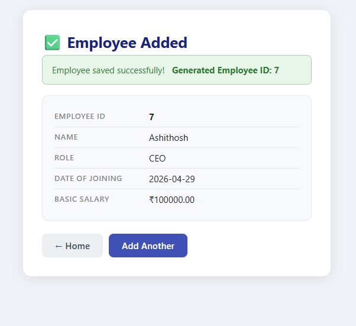
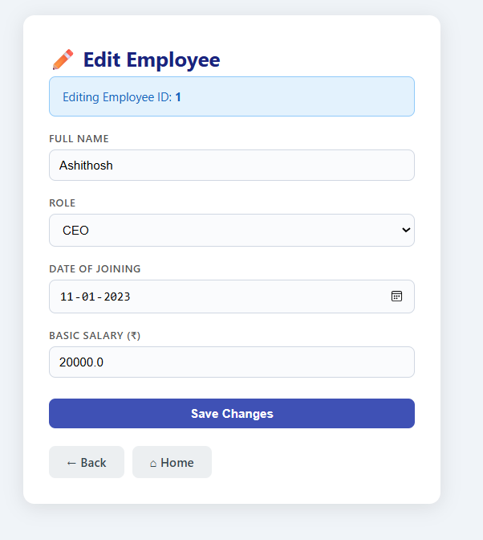
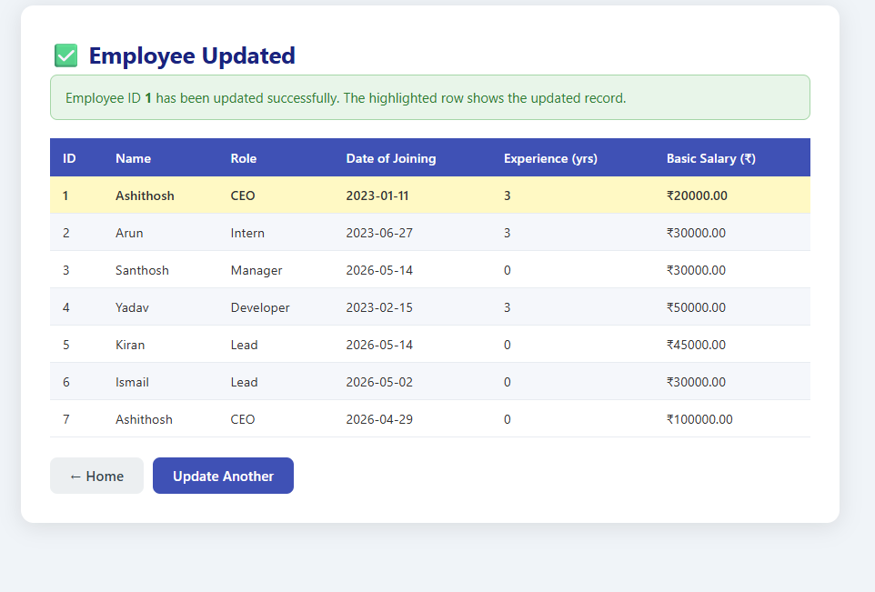
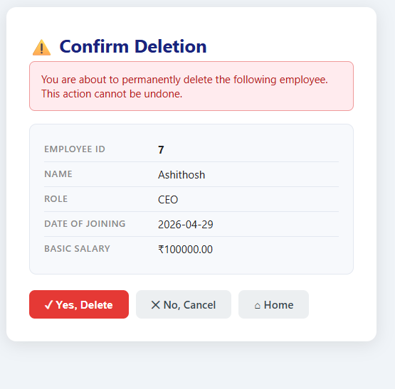
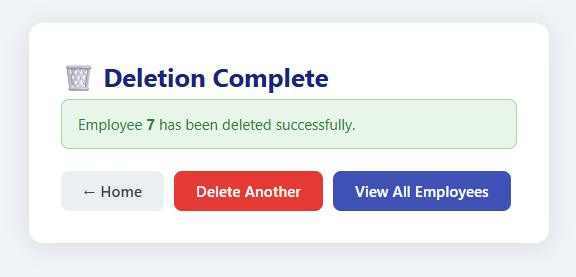
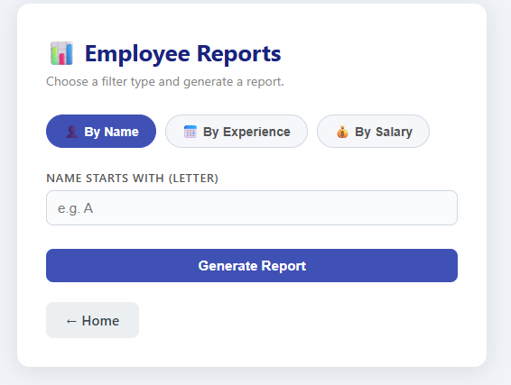

# 📘 Employee Management System (Mini Project)

## 👨‍🎓 Student Details

| Field   | Details              |
|---------|----------------------|
| **Name** | Ashithosh N         |
| **USN**  | 4AL24CS038          |
| **Subject** | Advanced Java with J2EE |

---

## 📌 Project Description

This is a **Dynamic Web Application** developed using **Java, JSP, Servlets, JDBC, and MySQL** to manage employee records.

The system supports:

* Auto-generated Employee IDs (AUTO\_INCREMENT)
* Add, Update, Delete, Display operations
* Pre-filled update form with live DB fetch
* Delete confirmation flow before permanent removal
* Report generation with Name, Experience range, and Salary range filters
* Clean, modern card-based UI with CSS styling
* Full MVC architecture with DAO pattern

---

## 🛠️ Technologies Used

| Layer       | Technology                        |
|-------------|-----------------------------------|
| Frontend    | HTML, JSP, CSS (Card-based UI)    |
| Backend     | Java Servlets                     |
| Database    | MySQL                             |
| Connectivity| JDBC (PreparedStatement only)     |
| Server      | Apache Tomcat                     |
| IDE         | Eclipse                           |

---

## 🗄️ Database Structure

```sql
CREATE DATABASE employee_db;
USE employee_db;

CREATE TABLE Employee (
    Empno    INT PRIMARY KEY AUTO_INCREMENT,
    EmpName  VARCHAR(100)  NOT NULL,
    Role     VARCHAR(50)   NOT NULL,
    DoJ      DATE          NOT NULL,
    Bsalary  DECIMAL(10,2) NOT NULL
);
```

> **Changes from original schema:**
> * `Empno` is now `AUTO_INCREMENT` — never entered manually
> * `Gender` column removed entirely
> * `Role` column added (CEO / Manager / Lead / Developer / Intern)
> * `DoJ` retained and used to calculate years of experience

---

## 📁 Project Structure

```
EmployeeWebApp/
├── src/main/java/com/employee/
│   ├── model/
│   │   └── Employee.java
│   ├── dao/
│   │   └── EmployeeDAO.java
│   └── servlet/
│       ├── GetNextIdServlet.java        ← NEW
│       ├── AddEmployeeServlet.java
│       ├── UpdateEmployeeServlet.java
│       ├── DeleteEmployeeServlet.java
│       ├── DisplayEmployeeServlet.java
│       └── ReportServlet.java
│
└── src/main/webapp/
    ├── index.jsp
    ├── empadd.jsp                       ← Updated
    ├── add_result.jsp                   ← NEW
    ├── empupdate.jsp                    ← Updated
    ├── update_form.jsp                  ← NEW
    ├── update_result.jsp                ← NEW
    ├── empdelete.jsp                    ← Updated
    ├── delete_confirm.jsp               ← NEW
    ├── delete_result.jsp                ← NEW
    ├── empdisplay.jsp                   ← Updated
    ├── report_form.jsp                  ← Updated
    ├── report_result.jsp                ← NEW
    ├── result.jsp
    └── css/
        └── style.css                   ← Updated
```

---

# ⚙️ Modules with Code & Screenshots

---

## 🏠 Home Page

* 🔗 [`index.jsp`](src/main/webapp/index.jsp)

**Features:**
* Card-based navigation menu
* Links to all 5 modules
* Add Employee card routes through `GetNextIdServlet` to pre-load the next ID

📸 Screenshot


---

## ➕ Add Employee

* 🔗 JSP: [`empadd.jsp`](src/main/webapp/empadd.jsp)
* 🔗 Result JSP: [`add_result.jsp`](src/main/webapp/add_result.jsp)
* 🔗 Servlet: [`AddEmployeeServlet.java`](src/main/java/com/employee/servlet/AddEmployeeServlet.java)
* 🔗 ID Fetch Servlet: [`GetNextIdServlet.java`](src/main/java/com/employee/servlet/GetNextIdServlet.java)
* 🔗 DAO: [`EmployeeDAO.java`](src/main/java/com/employee/dao/EmployeeDAO.java)

**Features:**
* Next Employee ID fetched from DB using `AUTO_INCREMENT` metadata and displayed as a **read-only preview** field before the form is submitted
* `Gender` field removed
* `Role` dropdown added: CEO → Manager → Lead → Developer → Intern
* `Date of Joining` field added
* Labels above every input field
* Client-side + server-side validation:
  * Name — alphabets only, not empty
  * Salary — must be > 0
* After insert: shows generated ID and full employee detail card

📸 Add Form


📸 Add Result


---

## ✏️ Update Employee

* 🔗 Lookup JSP: [`empupdate.jsp`](src/main/webapp/empupdate.jsp)
* 🔗 Edit Form JSP: [`update_form.jsp`](src/main/webapp/update_form.jsp)
* 🔗 Result JSP: [`update_result.jsp`](src/main/webapp/update_result.jsp)
* 🔗 Servlet: [`UpdateEmployeeServlet.java`](src/main/java/com/employee/servlet/UpdateEmployeeServlet.java)

**Features:**
* Two-step flow:
  1. Enter Employee ID → system fetches record from DB
  2. If found: pre-filled edit form shown; if not found: styled error message
* After update: displays **all employees** in a table with the updated row **highlighted in yellow**
* Validation same as Add module

📸 Lookup Step


📸 Pre-filled Edit Form


📸 Update Result (highlighted row)


---

## 🗑 Delete Employee

* 🔗 Lookup JSP: [`empdelete.jsp`](src/main/webapp/empdelete.jsp)
* 🔗 Confirmation JSP: [`delete_confirm.jsp`](src/main/webapp/delete_confirm.jsp)
* 🔗 Result JSP: [`delete_result.jsp`](src/main/webapp/delete_result.jsp)
* 🔗 Servlet: [`DeleteEmployeeServlet.java`](src/main/java/com/employee/servlet/DeleteEmployeeServlet.java)

**Features:**
* Three-step flow:
  1. Enter Employee ID
  2. System fetches and displays the employee's full details
  3. User confirms with **Yes / No** buttons before deletion occurs
* After deletion: shows message — *"Employee [ID] has been deleted successfully"*
* No accidental deletes — confirmation is mandatory

📸 Lookup Step


📸 Confirmation Screen


📸 Deletion Result


---

## 🔍 Display All Employees

* 🔗 JSP: [`empdisplay.jsp`](src/main/webapp/empdisplay.jsp)
* 🔗 Servlet: [`DisplayEmployeeServlet.java`](src/main/java/com/employee/servlet/DisplayEmployeeServlet.java)

**Features:**
* Displays all employee records in a styled table
* Columns: ID, Name, Role, Date of Joining, Experience (yrs), Basic Salary
* Experience auto-calculated from `DoJ` using `LocalDate`
* Alternating row colors for readability
* Left-aligned text throughout

📸 Screenshot


---

## 📊 Reports Module

### 🔹 Report Form

* 🔗 JSP: [`report_form.jsp`](src/main/webapp/report_form.jsp)

**Three tabbed filter sections:**

| Tab | Filter | Inputs |
|-----|--------|--------|
| By Name | `EmpName LIKE 'X%'` | Starting letter |
| By Experience | `TIMESTAMPDIFF(YEAR, DoJ, CURDATE()) BETWEEN ? AND ?` | From years, To years |
| By Salary | `Bsalary BETWEEN / >= / <=` | Min salary, Max salary (each optional) |

📸 Report Form


---

### 🔹 Report Results

* 🔗 Result JSP: [`report_result.jsp`](src/main/webapp/report_result.jsp)
* 🔗 Servlet: [`ReportServlet.java`](src/main/java/com/employee/servlet/ReportServlet.java)

**Salary filter smart logic:**

```java
if (min present && max present)  → WHERE Bsalary BETWEEN min AND max
if (only min present)            → WHERE Bsalary >= min
if (only max present)            → WHERE Bsalary <= max
```

📸 Report Result


---

# 🧱 Core Components

---

## 🧠 Model — `Employee.java`

* 🔗 [`Employee.java`](src/main/java/com/employee/model/Employee.java)

| Field    | Type     | Notes                    |
|----------|----------|--------------------------|
| `empno`  | `int`    | Auto-generated by DB     |
| `empName`| `String` | Alphabets only           |
| `role`   | `String` | One of 5 fixed roles     |
| `doj`    | `Date`   | Used for experience calc |
| `bsalary`| `double` | Must be > 0              |

> `Gender` field removed from model entirely.

---

## 🔌 DAO — `EmployeeDAO.java`

* 🔗 [`EmployeeDAO.java`](src/main/java/com/employee/dao/EmployeeDAO.java)

| Method | Description |
|--------|-------------|
| `getNextEmployeeId()` | Fetches `AUTO_INCREMENT` value from `information_schema` — no insert performed |
| `addEmployee(Employee e)` | Inserts and returns actual generated ID via `RETURN_GENERATED_KEYS` |
| `getEmployee(int empno)` | Fetches single employee by ID |
| `getAllEmployees()` | Returns all employees ordered by ID |
| `updateEmployee(Employee e)` | Updates all fields by Empno |
| `deleteEmployee(int empno)` | Deletes by Empno |
| `getReportByName(String letter)` | `LIKE 'X%'` filter |
| `getReportByExperience(int from, int to)` | `TIMESTAMPDIFF` range filter |
| `getReportBySalary(double min, double max)` | Smart min/max salary filter |

> All methods use `PreparedStatement` exclusively — no raw `Statement` used anywhere.

---

## 🎨 CSS — `style.css`

* 🔗 [`style.css`](src/main/webapp/css/style.css)

| Feature | Detail |
|---------|--------|
| Layout | Card-based, centered, max-width containers |
| Theme | Light, clean, white cards on `#f0f4f8` background |
| Forms | Labels above inputs, consistent spacing |
| Buttons | Color-coded: primary (blue), danger (red), secondary (grey) |
| Tables | Left-aligned, alternating row colors, indigo header |
| Alerts | Styled success (green), error (red), info (blue) boxes |
| Highlight | Yellow row highlight for updated employee |
| Read-only field | Dashed indigo border with light blue background |

---

# 📊 SQL Queries Used

### Name Filter
```sql
SELECT * FROM Employee WHERE EmpName LIKE 'A%' ORDER BY EmpName;
```

### Experience Range Filter
```sql
SELECT * FROM Employee
WHERE TIMESTAMPDIFF(YEAR, DoJ, CURDATE()) BETWEEN ? AND ?
ORDER BY DoJ;
```

### Salary Range Filter
```sql
-- Both bounds
SELECT * FROM Employee WHERE Bsalary BETWEEN ? AND ? ORDER BY Bsalary;

-- Only min
SELECT * FROM Employee WHERE Bsalary >= ? ORDER BY Bsalary;

-- Only max
SELECT * FROM Employee WHERE Bsalary <= ? ORDER BY Bsalary;
```

### Next Auto-Increment ID (no insert)
```sql
SELECT AUTO_INCREMENT
FROM information_schema.TABLES
WHERE TABLE_SCHEMA = 'employee_db'
AND TABLE_NAME = 'Employee';
```

---

# 🔄 Request Flow Diagrams

### Add Employee Flow
```
Home → /addEmployee (GetNextIdServlet)
     → empadd.jsp  [shows next ID, form]
     → POST /add   (AddEmployeeServlet)
     → add_result.jsp [confirms with real ID + detail card]
```

### Update Employee Flow
```
Home → empupdate.jsp [enter ID]
     → GET /update (UpdateEmployeeServlet)
     → ID found?  YES → update_form.jsp [pre-filled]
                  NO  → error on empupdate.jsp
     → POST /update
     → update_result.jsp [all employees, updated row highlighted]
```

### Delete Employee Flow
```
Home → empdelete.jsp [enter ID]
     → GET /delete (DeleteEmployeeServlet)
     → ID found?  YES → delete_confirm.jsp [show data + Yes/No]
                  NO  → error on empdelete.jsp
     → POST /delete (confirmed)
     → delete_result.jsp ["Employee X has been deleted"]
```

---

# ▶️ How to Run

1. Clone or import the project into **Eclipse**
2. Configure **Apache Tomcat** (v9 or above)
3. Add **MySQL Connector/J** JAR to:
   * Build Path (`Project → Properties → Java Build Path → Libraries`)
   * `src/main/webapp/WEB-INF/lib/`
4. Run the SQL script to create the database:
   ```sql
   CREATE DATABASE employee_db;
   USE employee_db;
   CREATE TABLE Employee (
       Empno    INT PRIMARY KEY AUTO_INCREMENT,
       EmpName  VARCHAR(100)  NOT NULL,
       Role     VARCHAR(50)   NOT NULL,
       DoJ      DATE          NOT NULL,
       Bsalary  DECIMAL(10,2) NOT NULL
   );
   ```
5. Update DB credentials in `EmployeeDAO.java`:
   ```java
   private String url  = "jdbc:mysql://localhost:3306/employee_db";
   private String user = "root";
   private String pass = "your_password";
   ```
6. **Run on Server** → Open browser at `http://localhost:8080/EmployeeWebApp/`

---

# 🧠 Conclusion

This project demonstrates a complete **Employee Management System** built with core Java EE technologies. It provides hands-on experience with:

* **MVC architecture** — clean separation of Model, View (JSP), and Controller (Servlet)
* **JDBC with PreparedStatement** — safe, injection-proof database operations
* **Auto-increment ID handling** — fetching MySQL metadata without dummy inserts
* **Multi-step user flows** — confirm-before-delete, pre-filled update forms
* **Dynamic report generation** — flexible salary, experience, and name filters
* **Modern JSP-based UI** — card layout, styled alerts, highlighted table rows

---

*Developed as a Mini Project for Advanced Java with J2EE — 4AL24CS038*
