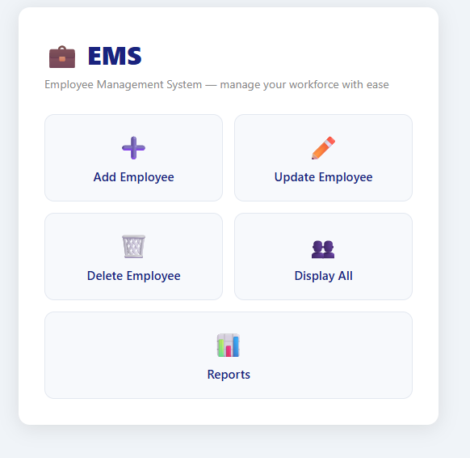
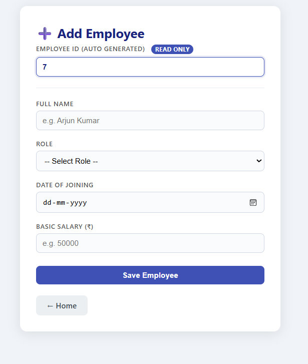
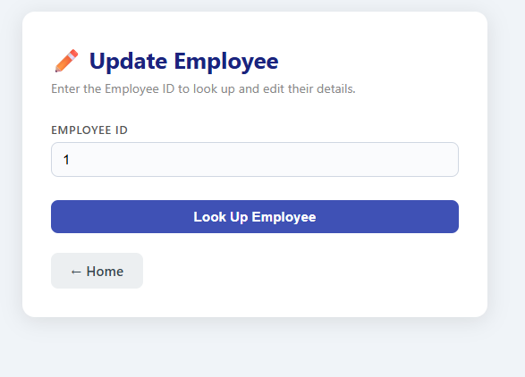
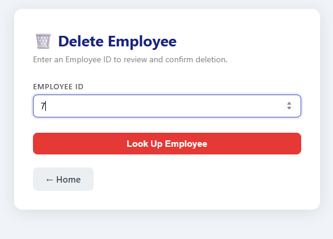
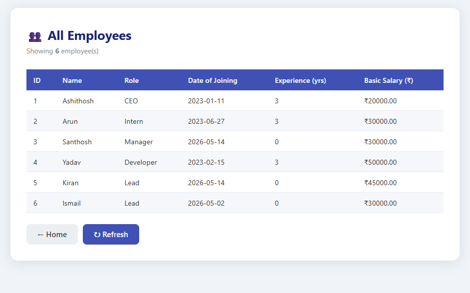
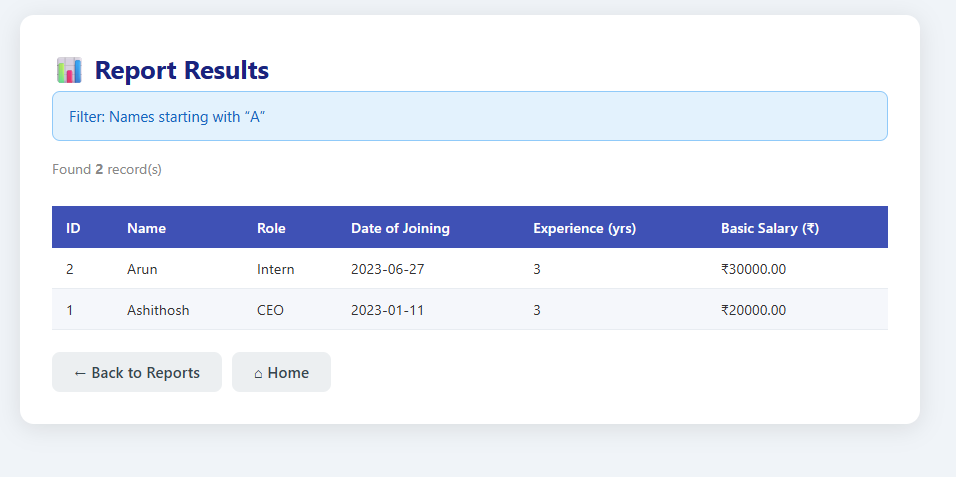

# 📘 Employee Management System (Mini Project)

## 👨‍🎓 Student Details

* **Name:** Ashithosh N
* **USN:** 4AL24CS038
* **Subject:** Advanced Java with J2EE

---

## 📌 Project Description

This is a **Dynamic Web Application** developed using **Java, JSP, Servlets, JDBC, and MySQL** to manage employee records.

The system supports:

* Add, Update, Delete, Display operations
* Report generation based on filters
* Clean UI with CSS styling

---

## 🛠️ Technologies Used

* Frontend: HTML, JSP, CSS
* Backend: Java Servlets
* Database: MySQL
* Connectivity: JDBC
* Server: Apache Tomcat
* IDE: Eclipse

---

## 🗄️ Database Structure

```sql id="e1"
CREATE TABLE Employee (
    Empno INT PRIMARY KEY,
    EmpName VARCHAR(100),
    DoJ DATE,
    Gender VARCHAR(10),
    Bsalary DECIMAL(10,2)
);
```

---

## 📁 Project Structure

```id="e2"
EmployeeWebApp/
├── src/main/java/com/employee/
│   ├── model/Employee.java
│   ├── dao/EmployeeDAO.java
│   └── servlet/
│       ├── AddEmployeeServlet.java
│       ├── UpdateEmployeeServlet.java
│       ├── DeleteEmployeeServlet.java
│       ├── DisplayEmployeeServlet.java
│       └── ReportServlet.java
│
├── src/main/webapp/
│   ├── index.jsp
│   ├── empadd.jsp
│   ├── empupdate.jsp
│   ├── empdelete.jsp
│   ├── empdisplay.jsp
│   ├── report_form.jsp
│   └── css/style.css
```

---

# ⚙️ Modules with Code & Screenshots

---

## 🏠 Home Page

* 🔗 [index.jsp](src/main/webapp/index.jsp)

📸 Screenshot


---

## ➕ Add Employee

* 🔗 JSP: [empadd.jsp](src/main/webapp/empadd.jsp)
* 🔗 Servlet: [AddEmployeeServlet.java](src/main/java/com/employee/servlet/AddEmployeeServlet.java)
* 🔗 DAO: [EmployeeDAO.java](src/main/java/com/employee/dao/EmployeeDAO.java)

📸 Screenshot


---

## ✏️ Update Employee

* 🔗 JSP: [empupdate.jsp](src/main/webapp/empupdate.jsp)
* 🔗 Servlet: [UpdateEmployeeServlet.java](src/main/java/com/employee/servlet/UpdateEmployeeServlet.java)

📸 Screenshot


---

## 🗑 Delete Employee

* 🔗 JSP: [empdelete.jsp](src/main/webapp/empdelete.jsp)
* 🔗 Servlet: [DeleteEmployeeServlet.java](src/main/java/com/employee/servlet/DeleteEmployeeServlet.java)

📸 Screenshot


---

## 🔍 Display Employee

* 🔗 JSP: [empdisplay.jsp](src/main/webapp/empdisplay.jsp)
* 🔗 Servlet: [DisplayEmployeeServlet.java](src/main/java/com/employee/servlet/DisplayEmployeeServlet.java)

📸 Screenshot


---

## 📊 Reports Module

### 🔹 Report Form

* 🔗 JSP: [report_form.jsp](src/main/webapp/report_form.jsp)

📸 Screenshot


---

### 🔹 Report Results

* 🔗 Servlet: [ReportServlet.java](src/main/java/com/employee/servlet/ReportServlet.java)

📸 Screenshot


---

# 🧱 Core Components

---

## 🧠 Model

* 🔗 [Employee.java](src/main/java/com/employee/model/Employee.java)

---

## 🔌 DAO

* 🔗 [EmployeeDAO.java](src/main/java/com/employee/dao/EmployeeDAO.java)

---

## 🎨 CSS

* 🔗 [style.css](src/main/webapp/css/style.css)

---

# 📊 Reports Implemented

### Employees whose names start with a specific letter

```sql id="e3"
SELECT * FROM Employee WHERE EmpName LIKE 'A%';
```

---

### Employees with N or more years of service

```sql id="e4"
SELECT * FROM Employee 
WHERE TIMESTAMPDIFF(YEAR, DoJ, CURDATE()) >= N;
```

---

### Employees earning more than a specified salary

```sql id="e5"
SELECT * FROM Employee WHERE Bsalary > X;
```

---

# ▶️ How to Run

1. Import project into Eclipse
2. Configure Apache Tomcat
3. Add MySQL Connector (Build Path + WEB-INF/lib)
4. Create database using SQL script
5. Run project on server

---

# 🧠 Conclusion

This project demonstrates a complete **Employee Management System** using Java technologies. It provides hands-on experience with **Servlets, JSP, JDBC, and MySQL integration**, along with a clean modular architecture and report generation.

---
